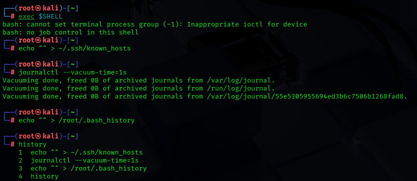

# System Hacking – Gaining and Maintaining Access 

**We need these:**  
Attacker Machine (example Kali Linux)  
Target Machine (example Metasploitable 2)  
Tools: Metasploit Framework, Nmap, Netcat, Hydra (for optional password cracking)  

In this repository, we will do some scanning operations, exploiting a vulnerable service, post-exploitation enumeration, privilage exploitation, creating a persistent backdoor and at the end, will clean up everything.  

## Basic system hacking  

**Step 1: Host Discovery & Scanning**  
We firstly find the target ip.  
  
We check the open ports and service versions.  
  
**Step 2: Exploiting**  
We cause to start Metasploit in Kali Linux.  
  
We find weak service.  
  
  
  
We get shell.  
  
**Step 3: Post-exploitation**  
We look at to users.  
  
Configuration the network:  
  
We look through some files.  
  
**Step 4: Privilege Escalation**  
Avtomatic checking  
  
Suid files  
  
We use exploit  
  
**Step 5: Persistence**  
Adding user  
  
Entrancing with ssh  
  
**Step 6: Cover Tracks**  
Deleting bash history  
  
Deleting the log files  
  
Changing the date  
  

